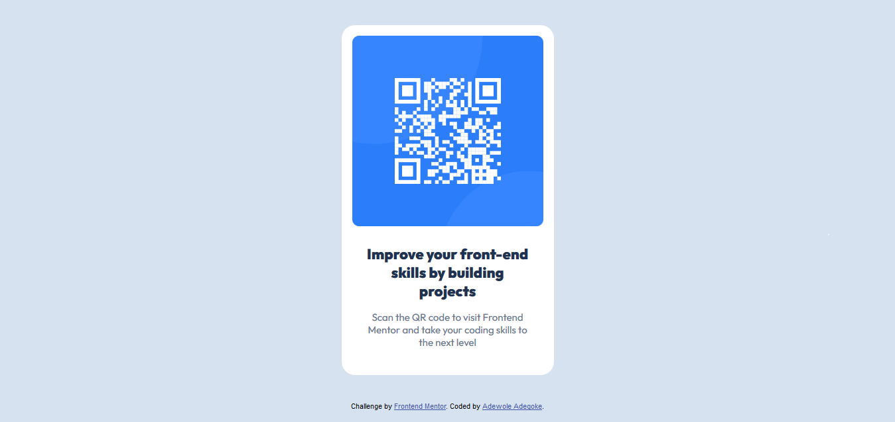

# Frontend Mentor - QR code component solution

This is a solution to the [QR code component challenge on Frontend Mentor](https://www.frontendmentor.io/challenges/qr-code-component-iux_sIO_H). Frontend Mentor challenges help you improve your coding skills by building realistic projects. 

## Table of contents

- [Overview](#overview)
  - [Screenshot](#screenshot)
  - [Links](#links)
- [My process](#my-process)
  - [Built with](#built-with)
  - [What I learned](#what-i-learned)
  - [Continued development](#continued-development)
- [Author](#author)


## Overview

### Screenshot




### Links

- Solution URL: [Solution URL](https://github.com/Adewoleadegoke/qr-code-component)
- Live Site URL: [Live site URL](https://qr-code-component-tau-azure.vercel.app/)

## My process

### Built with

- Semantic HTML5 markup
- CSS custom properties


### What I learned

I learned more or how to use CSS properties padding and margin to structure the code elements
```css
.qr {
  padding: 16px;
  margin: auto;
}
```


### Continued development


I want to continue focusing on the div element and the padding and margin CSS properties to help structure and arrange certain elements like text, images and others.


## Author

- Frontend Mentor - [@Adewoleadegoke](https://www.frontendmentor.io/profile/Adewoleadegoke)
